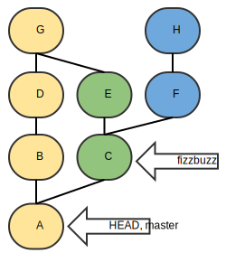

# HEAD@^~ - Ukens GIT #7-2

Denne dassinformasjonen begynner på det andre toalettet, der kan du lese om HEAD, HEAD@ og andre navngitte referanser.

### HEAD^ og HEAD~

Som vi så på forrige toalett kunne vi bruke `@`-operatoren til å navigere i historikken vår. På dette toalettet skal vi se på `^` og `~` som lar oss referere relativt i commit-treet.

#### HEAD^

`^` er en foreldre-velger, den lar oss velge blant nodene som er direkte foreldre til en gitt node. I figuren ser vi at master/A har to foreldre, i dette tilfelle vil vi kunne nå `B` med `A^1` og `C` med `A^2`. Dersom bare `^` er angitt antas `^1`, mao `A^=B`.

Flere operatorer kan slåes sammen for å navigere oppover i treet. `A^^ = A^1^1 = A->B->D` for å nå D fra A.

#### HEAD~

`~` lar oss navigere i generasjoner, den vil alltid velge første forelder. `A~ = A~1 = B`, vi navigerer en generasjon oppover i treet via første forelder. `A~2 = A->B->D` - to generasjoner bakover, alltid via første forelder.

### DassQuiz

	$ git reflog
	0dfbba3 HEAD@{0}: checkout: moving from fizzbuzz to master
	525ddab HEAD@{1}: checkout: moving from master to fizzbuzz

Fasit: <a href="http://goo.gl/4USXJB">http://goo.gl/4USXJB</a> 

1. `A~3 = ?`
2. `master^2 = ?`
3. `master^2^2^ = ?`
4. `fizzbuzz^~ = ?`
5. `HEAD^2~2 = ?`
6. `HEAD@{1} = ?`
7. `HEAD@{1}~2 = ?`
8. `HEAD@{-1}^2~ = ?`
9. `0dfbba3^^^ = ?`
10. `525ddab^2 = ?`

